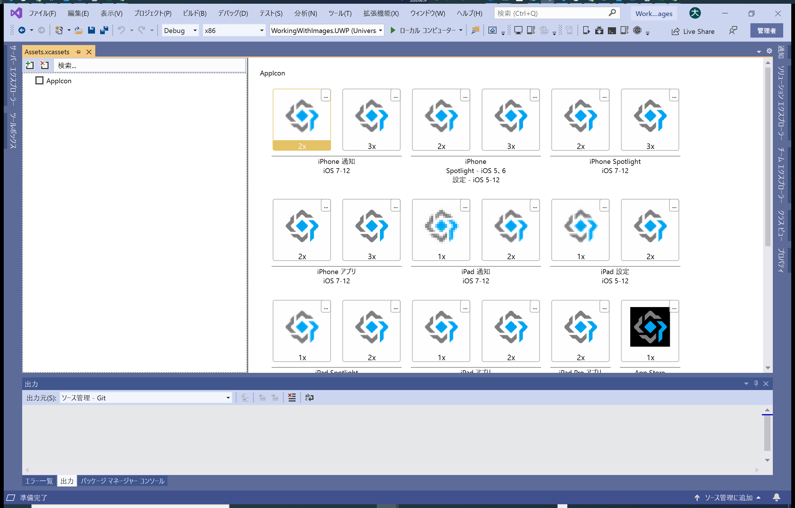

# WorkingWithImageサンプル

## 1. 完成イメージ
【iPhone】


【Android】


【UWP】


## 2. 最初にすること

このサンプルは、３つのタブで構成されているので、とりあえず共有プロジェクトのMainPage.xamlをTabbedPageに変え、埋込イメージ、ダウンロードイメージ、ローカルイメージの３つのサンプルを表示させるためのページEmbeddedImagePage.xaml、DownloadImagePage.xaml、LocalImagePage.xamlを作成する。（Prism ContentPageで作れば、ViewModelの自動生成と、App.xamlに自動的にコンテナ登録される。)
MainPage.xamlを以下のように変更して、すべてのタブを登録する。

``` XAML
<?xml version="1.0" encoding="utf-8" ?>
<TabbedPage xmlns="http://xamarin.com/schemas/2014/forms"
			xmlns:x="http://schemas.microsoft.com/winfx/2009/xaml"
			xmlns:prism="http://prismlibrary.com"
			prism:ViewModelLocator.AutowireViewModel="True"
			x:Class="WorkingWithImages.Views.MainPage"
			xmlns:local="clr-namespace:WorkingWithImages.Views"
			Title="WorkingWithImages">
	<local:EmbeddedImagePage Title="EmbeddedImage"
							 IconImageSource="xaml.png"/>
	<local:DownloadImagePage Title="DownloadImage"
							 IconImageSource="xaml.png"/>
	<local:LocalImagePage Title="LocalImage"
						  IconImageSource="xaml.png"/>
</TabbedPage>
```
そのあとに、MainPage.xaml.csファイルがContentPageを継承しているので、TabbedPageを継承するように変更する。
※もともとContentPageだったページをTabbedPageに変更したので、このような修正が必要です。

``` C#
using Xamarin.Forms;

namespace WorkingWithImages.Views
{
	public partial class MainPage : TabbedPage
	{
		public MainPage()
		{
			InitializeComponent();
		}
	}
}
```

とりあえず、これでタブが表示されるMainPageが完成である。

## 3.埋め込みイメージを表示させる。

### 3.1. ImageResourceの拡張メソッドを作成

共有プロジェクトにExtenstionsフォルダを作成して、ImageResourceを拡張するメソッドを用意する。詳細については[「XAMLマークアップ拡張の作成/ビットマップにアクセスするためのマークアップ拡張機能」](https://docs.microsoft.com/ja-jp/xamarin/xamarin-forms/xaml/markup-extensions/creating)を参照してください。

※元のソースの拡張メソッドではなく、上記リンク先に記載されている形で拡張メソッドを作成しています。

``` C#
using System;
using System.Reflection;
using System.Xml;
using Xamarin.Forms;
using Xamarin.Forms.Xaml;

namespace WorkingWithImages.Extensions
{
	[ContentProperty(nameof(Source))]
	public class ImageResourceExtension : IMarkupExtension<ImageSource>
	{
		public string Source { get; set; }

		public ImageSource ProvideValue(IServiceProvider serviceProvider)
		{
			if (String.IsNullOrEmpty(Source))
			{
				//IXmlLineInfoProvider:特定のエラーが検出されたことを示す行や文字の情報を提供するオブジェクト
				IXmlLineInfoProvider lineInfoProvider = serviceProvider.GetService(typeof(IXmlLineInfoProvider)) as IXmlLineInfoProvider;
				IXmlLineInfo lineInfo = (lineInfoProvider != null) ? lineInfoProvider.XmlLineInfo : new XmlLineInfo();
				throw new XamlParseException("ImageResourceExtensionはSourceプロパティを設定する必要があります。", lineInfo);
			}

			string assemblyName = GetType().GetTypeInfo().Assembly.GetName().Name;
			var imageSource = ImageSource.FromResource(assemblyName + "." + Source, typeof(ImageResourceExtension).GetTypeInfo().Assembly);
			return imageSource;
		}

		object IMarkupExtension.ProvideValue(IServiceProvider serviceProvider)
		{
			return (this as IMarkupExtension<ImageSource>).ProvideValue(serviceProvider);
		}
	}
}

```

この拡張メソッドを利用することで、XAML上のイメージコントロールに埋め込みリソースを設定することができます。
作成した一番目のタブEmbeddedImagePage.xamlを以下のように修正します。

``` XAML
<?xml version="1.0" encoding="utf-8" ?>
<ContentPage xmlns="http://xamarin.com/schemas/2014/forms"
             xmlns:x="http://schemas.microsoft.com/winfx/2009/xaml"
             xmlns:prism="http://prismlibrary.com"
             prism:ViewModelLocator.AutowireViewModel="True"
			 xmlns:local="clr-namespace:WorkingWithImages.Extensions"
			 x:Class="WorkingWithImages.Views.EmbeddedImagePage">
	<StackLayout Margin="20, 35, 20, 20">
		<Label Text="Image Embedded Resource XAML"
			   FontAttributes="Bold"
			   HorizontalOptions="Center" />
		<Image Source="{local:ImageResource Images.beach.jpg}" />
		<Label Text="この画像はXAMLで参照された埋込リソースです。デバイスのピクセル密度（iOS Retinaなど）に関係なく、同じ画像ファイルが使用されます。" />
	</StackLayout>
</ContentPage>

```
加えて、共有プロジェクトにImagesフォルダを作成し、beach.jpg・waterfront.jpg・waterfront@2x.jpgファイルを格納して、beach.jpgプロパティの「ビルドアクション」→「埋込リソース」に変更します。

※waterfront.jpg、watefront@2x.jpgは、ローカルイメージの所で使用します。

これで、デバッグ実行すれば、一つ目のタブはうまく表示されると思います。

埋込リソースにしたメリットとしては、プラットフォームに依存しない形で画像を表示できるということになります。

## 4. ダウンロードイメージを表示させる。

続いて２番目のタブです。こちらはインターネットに存在している画像を画面に表示させる方法です。

まずは、DownloadImages.xamlを以下のように修正します。

``` XAML
<?xml version="1.0" encoding="utf-8" ?>
<ContentPage xmlns="http://xamarin.com/schemas/2014/forms"
             xmlns:x="http://schemas.microsoft.com/winfx/2009/xaml"
             xmlns:prism="http://prismlibrary.com"
             prism:ViewModelLocator.AutowireViewModel="True"
             x:Class="WorkingWithImages.Views.DownloadImagePage">
	<StackLayout Margin="20, 35, 20, 20">
		<Label Text="Image UriSource XAML"
			   FontAttributes="Bold"
			   HorizontalOptions="Center" />
		<Image Source="https://aka.ms/campus.jpg" />
		<Image>
			<Image.Source>
				<UriImageSource Uri="https://aka.ms/campus.jpg"
								CacheValidity="10:00:00.0" />
			</Image.Source>
		</Image>
		<Label Text="この画像はmicrosoft.comからダウンロードされます。" />
	</StackLayout>
</ContentPage>
```

単に、ImageのSourceプロパティにURLをしているものと、その下はキャッシュが無効になる時間(CacheValidity)を指定してURLの画像を読み込んでいるものになります。

こちらも埋め込みリソースと同様、プラットフォームに依存しない形で画像を表示できますが、デメリットとしてはインターネットに接続できない環境では画面が表示されない状態になってしまうのと、画像が表示されるのが通信速度に依存してしまうといった内容になります。

## 5. ローカルイメージを表示させる。

3番目のローカルイメージは、各プラットフォームごとに画像を用意して表示させる方法です。注意しなくてはならないのは、各プラットフォームごとに画像を用意する割には、ファイル名は一緒にする必要があるということで、ファイル名はAndoroidリソース名の制約で以下の文字を使う必要がある。
- 小文字
- 数字
- アンダースコア
- ピリオド

各プラットフォームごとのイメージ格納場所は以下になる。

|プラットフォーム|置き場所|
|:--|:--|
|iOS|資産カタログイメージセットを使用する。|
|Android|リソース/作成ディレクトリにイメージを配置する。|
|UWP|ビルドアクションを使用してアプリケーションのルートに配置する。|

### 5.1. iOSのイメージを設定する。

iOSのプロジェクトの中にある「資産カタログ」の配下にある「Assets」をダブルクリックしてAssets.xcassetsを開きます。



左上にある「＋」ボタンをクリックして、表示されるポップアップメニューから「イメージセットの追加」を選択すると、Imagesというイメージセットが作成されるので、作成されたImagesの名前を「waterfront」に変更する。

「1x」と「2x」のアイコンの右上をクリックするとファイル選択ダイアログが表示されるので、共有プロジェクトのImagesに格納されているwaterfront.jpgとwaterfront@2x.jpgを各自選択する。


これで各解像度に対応したイメージが呼び出される。
呼び出すときはXAMLでこれだけ

```XAML
<Image Source="waterfront.jpg">
```

これ以外にiPhoneでは、PDFなどのVectorデータを設定することもできるが、ここでは割愛する。詳しくは「[Xamarinでのイメージの表示](https://docs.microsoft.com/ja-jp/xamarin/ios/app-fundamentals/images-icons/displaying-an-image?tabs=windows)」参照

### 5.2. Androidのイメージを設定する。

元のソースだと、以下のようなフォルダがResourceフォルダの配下にあって、waterfront.jpgが格納されています。
drawableと書いたフォルダに画面解像度に応じたファイルを用意する必要があります。

|フォルダ名称|csharp.png|icon.png|waterfront.jpg|xaml.png|
|:--|:--|:--|:--|:--|
|drawable|30x30|48x48|300x300|30x30|
|drawable-hdpi|-|72x72|600x600|-|
|drawable-ldpi|-|36x36|300x300|-|
|drawable-mdpi|-|48x48|450x450|-|
|drawable-xhdpi|-|96x96|600x600|-|
|drawable-xxhdpi|-|144x144|900x900|-|

Prismテンプレートだと、上記フォルダは作成されていないので、フォルダを作成してそこに画像ファイルをコピーします。

ファイル格納後、VisualStudioのソリューションエクスプローラの右上にあるアイコンの「すべてのファイルを表示」を選択して、プロジェクトに含まれていないファイルを表示させて、各drawableフォルダに格納されたwaterfront.jpgを順次プロジェクトに含めた後、各画像を右クリックしてプロパティを表示させ、「ビルドアクション」が「AndroidResource」になっていることを確認します。

これでAndroidのイメージ設定は完了です。

### 5.3. UWPのイメージを設定する。

規定だと、アプリケーションのルートに「ビルドアクション」が「コンテンツ」で、「出力ディレクトリにコピー」が「常にコピーする」に指定しておけば出力される様です。

## 6. Gifアニメを表示させる。

以上で、イメージサンプルを作成しましたが、おまけでGifアニメーションの読込についても、参照したドキュメントに掲載されていたので、追加のタブAnimationGifPage.xamlを追加してAnimationGifPage.xamlの内容を以下のように変更します。

※iOSでは、うまく表示させることができなかったので、今回のサンプルではAndroidとUWPで動作させています。

``` XAML
<?xml version="1.0" encoding="utf-8" ?>
<ContentPage xmlns="http://xamarin.com/schemas/2014/forms"
             xmlns:x="http://schemas.microsoft.com/winfx/2009/xaml"
             xmlns:prism="http://prismlibrary.com"
             prism:ViewModelLocator.AutowireViewModel="True"
			 xmlns:local="clr-namespace:WorkingWithImages.Extensions"
             x:Class="WorkingWithImages.Views.AnimationGifPage">
	<StackLayout Orientation="Vertical">
		<Image Source="Images/wave.gif" IsAnimationPlaying="True" />
	</StackLayout>
</ContentPage>
```

次に、共有プロジェクトのImagesフォルダにgifアニメであるwave.gifを格納して「ビルドアクション」を「埋め込みリソース」に変更します。

AndoroidプロジェクトのResourcesフォルダのdrawableフォルダにwave.gifファイルを格納します。

最後に、MainPage.xamlにAnimationGifPageのタブを追加して完了です。
```XAML
<?xml version="1.0" encoding="utf-8" ?>
<TabbedPage xmlns="http://xamarin.com/schemas/2014/forms"
			xmlns:x="http://schemas.microsoft.com/winfx/2009/xaml"
			xmlns:prism="http://prismlibrary.com"
			prism:ViewModelLocator.AutowireViewModel="True"
			x:Class="WorkingWithImages.Views.MainPage"
			xmlns:local="clr-namespace:WorkingWithImages.Views"
			Title="WorkingWithImages">
	<local:EmbeddedImagePage Title="EmbeddedImage"
							 IconImageSource="xaml.png"/>
	<local:DownloadImagePage Title="DownloadImage"
							 IconImageSource="xaml.png"/>
	<local:LocalImagePage Title="LocalImage"
						  IconImageSource="xaml.png"/>
	<local:AnimationGifPage Title="AnimationGif"
							IconImageSource="xaml.png"/>
</TabbedPage>
```

## 7. 参考情報
[Xamarin.Formsでのイメージ](https://docs.microsoft.com/xamarin/xamarin-forms/user-interface/images)<br>
[Xamarinでのイメージの表示](https://docs.microsoft.com/ja-jp/xamarin/ios/app-fundamentals/images-icons/displaying-an-image?tabs=windows)<br>
[XAMLマークアップ拡張の作成/ビットマップにアクセスするためのマークアップ拡張機能](https://docs.microsoft.com/ja-jp/xamarin/xamarin-forms/xaml/markup-extensions/creating)<br>
[Windows 上の既定のイメージディレクトリ](https://docs.microsoft.com/ja-jp/xamarin/xamarin-forms/platform/windows/default-image-directory)
